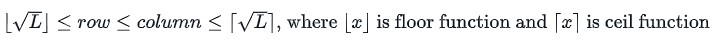
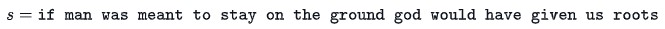

# Encryption

An English text needs to be encrypted using the following encryption scheme.
First, the spaces are removed from the text. Let **L** be the length of this text.
Then, characters are written into a grid, whose rows and columns have the following constraints:



**Example**



After removing spaces, the string is 54 characters long. **&#x221A;54** is between **7** and **8**, so it is written in the form of a grid with 7 rows and 8 columns.
```
ifmanwas  
meanttos          
tayonthe  
groundgo  
dwouldha  
vegivenu  
sroots
```
* Ensure that **rows x columns &#8805; L**
* If multiple grids satisfy the above conditions, choose the one with the minimum area, i.e. **rows x columns**

The encoded message is obtained by displaying the characters of each column, with a space between column texts. The encoded message for the grid above is:
```
imtgdvs fearwer mayoogo anouuio ntnnlvt wttddes aohghn sseoau
```
## Create the function **encryption** to encode a message.
### Encryption has the following parameter(s):
* string s: a string to encrypt
### Input Format
One line of text, the string **S**

### Returns
* string: the encrypted string

```
public static string encryption(string s)
{

}
```

## Samples
-------------------
### Sample Input 0
```
haveaniceday
```
### Sample Output 0
```
hae and via ecy
```
### Explanation 0
**L** = 12

**&#x221A;12** is between **3** and **4**.

Rewriten with **3** rown and **4** columns:
```
have
anic
eday
```
--------------------
### Sample Input 1
```
feedthedog
```
### Sample Output 1
```
fto ehg ee dd
```
### Explanation 1
**L** = 10

**&#x221A;10** is between **3** and **4**.

Rewriten with **3** rown and **4** columns:
```
feed
thed
og
```
---------------------
### Sample Input 2
```
chillout
```
### Sample Output 2
```
clu hlt io
```
### Explanation 2
**L** = 8

**&#x221A;8** is between **2** and **3**.

Rewriten with **3** rown and **3** columns:
```
chi
llo
ut
```